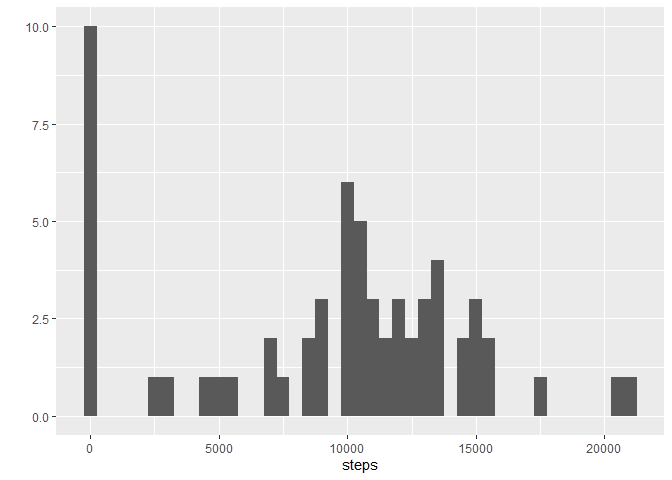
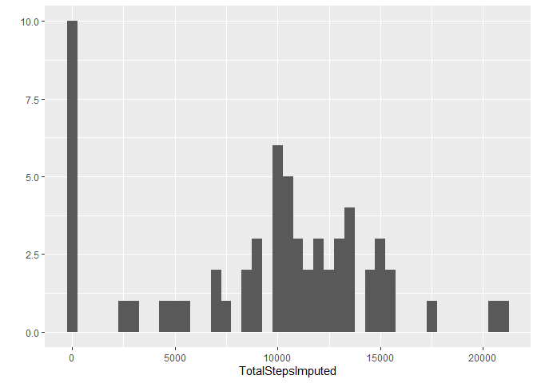
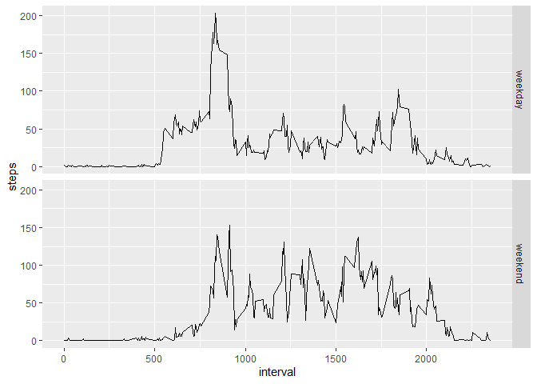

## Loading and preprocessing the data

### Loading packages:

#### ggplot for graphs, Hmisc for imputation.


```r
library(ggplot2)
library(Hmisc)
```

```
## Loading required package: lattice
```

```
## Loading required package: survival
```

```
## Loading required package: Formula
```

```
## 
## Attaching package: 'Hmisc'
```

```
## The following objects are masked from 'package:base':
## 
##     format.pval, units
```
#### Check if file has already been downloaded and unzipped, if not -> do so


```r
if (!file.exists("activitydata.zip")) {
  download.file("https://d396qusza40orc.cloudfront.net/repdata%2Fdata%2Factivity.zip", "activitydata.zip")
}

if (!file.exists("activity.csv")) { 
  unzip("activitydata.zip") 
}
```

## Reading dataset


```r
activitydata <- read.csv("activity.csv")
```

## What is mean total number of steps taken per day?


```r
TotalSteps <- tapply(activitydata$steps, activitydata$date, sum, na.rm=T)
StepsDF <- as.data.frame.table(TotalSteps)
names(StepsDF) <- c('date', 'steps')
```

### 1. Make histogram of total steps

```r
qplot(x = steps, data=StepsDF, binwidth=500)
```

<!-- -->

### 2. Calculate and report the mean and median total number of steps taken per day


```r
TotalStepsMean <- mean(TotalSteps)
TotalStepsMedian <- median(TotalSteps)
TotalStepsMean
```

```
## [1] 9354.23
```

```r
TotalStepsMedian
```

```
## [1] 10395
```

## What is the average daily activity pattern?

### Calculate Interval blocks average


```r
ActIntervalMean <- aggregate(steps ~ interval, data=activitydata, FUN=mean, na.rm=T)
```

### 1. Make a time series plot


```r
ggplot(ActIntervalMean, aes(x=interval, y=steps))+geom_line()
```

<!-- -->

### 2. Which 5-minute interval, on average across all the days in the dataset, contains the maximum number of steps?


```r
ActIntervalMean[which.max(ActIntervalMean$steps),'interval']
```

```
## [1] 835
```


## Imputing missing values

### 1. Calculate and report the total number of missing values in the dataset (i.e. the total number of rows with NAs)


```r
sum(is.na(activitydata$steps))
```

```
## [1] 2304
```

### 2.Devise a strategy for filling in all of the missing values in the dataset. 
### 3. Create a new dataset that is equal to the original dataset but with the missing data filled in.
#### NOTE; opted for imputing with median, which is the default of the oimpute function of the Hmisc package.


```r
activitydataimputed <- activitydata
activitydataimputed$steps <- impute(activitydata$steps)
```

### 4. Make a histogram of the total number of steps taken each day


```r
TotalStepsImputed <- tapply(activitydataimputed$steps, activitydataimputed$date, sum, na.rm=T)
qplot(TotalStepsImputed, binwidth=500)
```

<!-- -->

### Calculate and report the mean and median total number of steps taken per day


```r
TotalStepImputedMean <- mean(TotalStepsImputed)
TotalStepsImputedMedian <- median(TotalStepsImputed)
TotalStepImputedMean
```

```
## [1] 9354.23
```

```r
TotalStepsImputedMedian
```

```
## [1] 10395
```

## Are there differences in activity patterns between weekdays and weekends?


### Create a new factor variable in the dataset with two levels -- "weekday" and "weekend" indicating whether a given date is a weekday or weekend day.


```r
activitydataimputed$asDate <- as.Date(activitydataimputed$date)
activitydataimputed$day <- weekdays(activitydataimputed$asDate)
activitydataimputed$daytype <- ifelse(activitydataimputed$day %in% c("Saturday", "Sunday"), "weekend", "weekday")
```
### Make a panel plot containing a time series plot (i.e. type = "l") of the 5-minute interval (x-axis) and the average number of steps taken, averaged across all weekday days or weekend days (y-axis).


```r
ActIntervalImputedAndByDaytype <- aggregate(steps ~ interval + daytype, data=activitydataimputed, FUN=mean, na.rm=T)
ggplot(ActIntervalImputedAndByDaytype, aes(x=interval, y=steps))+geom_line()+ facet_grid(daytype ~ .)
```

<!-- -->


